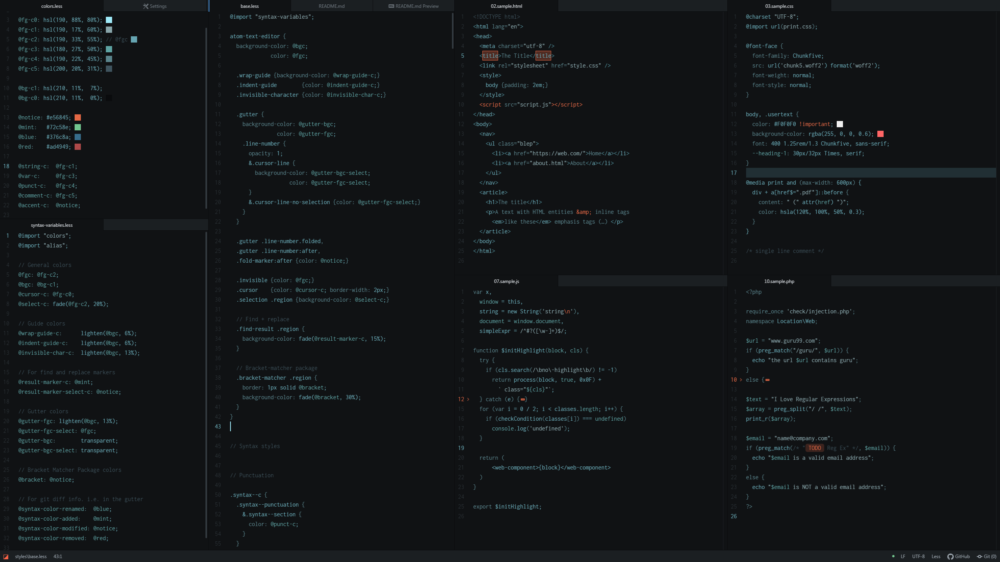

# cathode-syntax theme

A sleek dark syntax theme for Atom, part of Moth's [FONC YOU](https://germanponte.com/moth/foncyou/) collection.

Cathode is a modern take on the Olden Monitor subject, in bluish, not-really-monochrome hues that submerge you in an ocean of cyberspatial electrons.

`Font: Inconsolata / UI: One Dark / CSS colors: highlight-colors by brumm (not part of the theme)`

Perfect choice for hackers who work in monitor-lit lairs and retro-futuristic evil corporations intent on replacing humanity with robot dopplegängers.

## Features

+ Cool. Blue. Retro.
+ Medium contrast.
+ Medium brightness.
+ No font variations, except in .md source.
+ Sparse color accent.
+ Whimsical approach.

## Installation

+ In Atom, go to *Settings* > *Install*.
+ Click the `Themes` button and search for `cathode`.
+ Browse the results for `cathode-syntax` and click `Install`.
+ Go back to *Settings*, click *Themes*.
+ In the drop-down menu under "Syntax Theme", choose "cathode-syntax".

## FONC YOU

Moth's FONC YOU (Few Or No Colors Yield Optimal Usage) collection is a sedate approach to Atom syntax highlighting for those who wish to engage in chromatic austerity.

Dark themes:

+ *Cathode*
+ [Moth One](https://github.com/moth-g/moth-one-syntax)
+ [Moth Mono](https://github.com/moth-g/moth-mono-syntax)
+ [Moth Dark](https://github.com/moth-g/moth-dark-syntax)

Light Themes:

+ [Anode](https://github.com/moth-g/anode-syntax)
+ [Moth Light](https://github.com/moth-g/moth-light-syntax)

Learn more and see the themes in action at the [FONC YOU web page](https://germanponte.com/moth/foncyou/).
